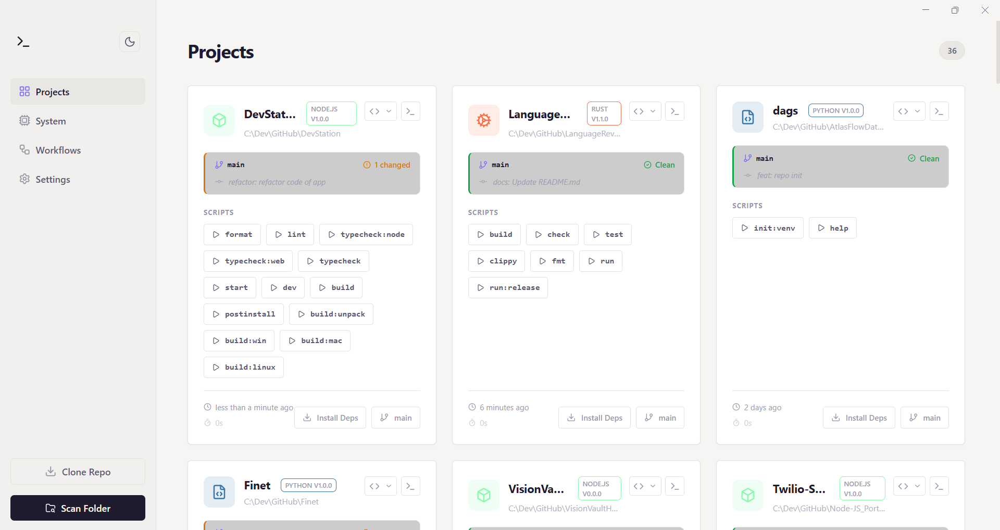

# DevStation 🚀

**DevStation** is an all-in-one local development dashboard designed to consolidate your entire workflow. It combines project management, system monitoring, and a powerful visual automation engine into a single, native desktop application.



## ✨ Key Features

### 🖥️ Project Dashboard

- **Auto-Detection:** Automatically scans directories to find projects (Node.js, Rust, Python, Go, PHP, etc.).
- **Smart Cards:** Identifies project types (`package.json`, `Cargo.toml`, etc.) and displays relevant metadata.
- **One-Click Actions:** Open directly in VS Code or run default start scripts instantly.

### ⚡ Automation Workflow Builder

- **Visual Node Editor:** Drag-and-drop interface to build complex automation flows.
- **Triggers:**
  - `On File Change` (Watch folders).
  - `On Git Pull`.
  - `Cron Schedule`.
  - `On App Start`.
- **Logic & Branching:** Use **Condition Nodes** to branch logic based on command outputs (e.g., "If tests fail, send Slack notification").
- **Integrations:**
  - **HTTP Requests:** GET/POST to external APIs.
  - **System Notifications:** Native OS notifications + In-App Toasts.
  - **Shell Commands:** Execute generic commands with input piping.

### 📟 Smart Terminal

- **Integrated Console:** Run scripts without leaving the dashboard.
- **Process Management:** Kill stuck processes (Node, Docker, Python) with one click.
- **Visual Feedback:** Color-coded logs and success/error indicators.

### 📊 System Monitor

- **Real-Time Stats:** Live tracking of CPU usage, Memory (RAM), and Uptime.
- **Docker Control:** Start, Stop, and Restart Docker Desktop services directly from the UI.

### ⌨️ Command Palette (`Cmd/Ctrl + K`)

- A global spotlight-style search to:
  - Jump to any project.
  - Run package scripts (npm run dev, build, etc.).
  - Execute automation workflows.
  - Control system services.

## 🛠️ Tech Stack

- **Runtime:** [Electron](https://www.electronjs.org/) (Cross-platform)
- **Frontend:** React + TypeScript + Vite
- **State Management:** Zustand
- **Styling:** SCSS Modules + CSS Variables (Theming)
- **Visual Engine:** React Flow

## 📦 Downloads (Pre-built)

Don't want to build from source? You can download the latest installer for your operating system from the **[Releases Page](https://github.com/your-username/devstation/releases)**.

- **Windows:** `.exe` installer
- **macOS:** `.dmg` image
- **Linux:** `.AppImage` or `.deb`

## 🚀 Getting Started

### Prerequisites

**⚠️ Important:** This project uses native Node.js modules (for system monitoring and terminal processes). You **must** have **C++ Build Tools** installed before running `npm install`.

1. **Node.js** (v22)
2. **Native Build Tools (node-gyp requirements):**
   - **Windows:** Install [Visual Studio Build Tools](https://visualstudio.microsoft.com/visual-cpp-build-tools/) (select "Desktop development with C++") and Python.
   - **macOS:** Install Xcode Command Line Tools: `xcode-select --install`
   - **Linux:** Install build essentials: `sudo apt-get install build-essential python3`

### Installation

1. **Clone the repository**

```bash
  git clone [https://github.com/your-username/devstation.git](https://github.com/your-username/devstation.git)
  cd devstation
```

2. **Install dependencies**
*Note: This step triggers native compilation. Ensure prerequisites above are met.*

```bash
npm install

```

3. **Run in Development Mode**

```bash
npm run dev

```

4. **Build for Production**
To create a standalone executable (`.exe`, `.dmg`, `.AppImage`):

```bash
npm run build

```

The output files will be generated in the `dist/` folder.
