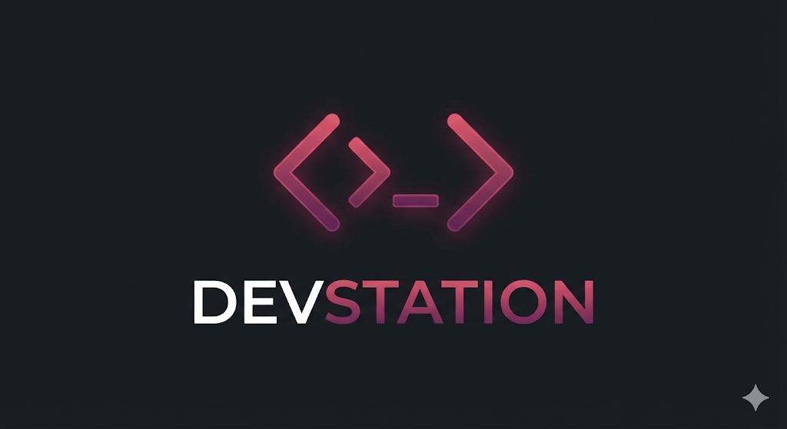

# DevStation 🚀

**DevStation** is an all-in-one local development dashboard designed to consolidate your entire workflow. It combines project management, git operations, system monitoring, and a powerful visual automation engine into a single, native desktop application.



## ✨ Key Features


### 🖥️ Project Dashboard

- **Auto-Detection:** Automatically scans directories to find projects (Node.js, Rust, Python, Go, PHP, etc.).
- **Smart Cards:** Identifies project types (`package.json`, `Cargo.toml`, etc.) and displays relevant metadata. Displays real-time status, dependencies, and last modified times.
- **IDE Integration:** Open projects in VS Code, WebStorm, PyCharm, Rider, or define your own **Custom Editor**.
- **Performance:** Configure "Ignored Folders" (like `node_modules`, `dist`) for lightning-fast scanning.
- **One-Click Actions:** Open directly in VS Code or run default start scripts instantly.

### 🐙 Integrated Git Manager

- **Full Lifecycle Management:** Not just status checks—perform **Commits** and **Stashes** directly from the dashboard.
- **Branch Switching:** Seamlessly switch branches via a dedicated modal with built-in safety checks for uncommitted changes.
- **Visual Status:** See file changes, ahead/behind commit counts, and current branch status updated in real-time.
- **Smart Clone:** Clone repositories via URL or **login with GitHub** to browse and clone your private repos directly.
- **Quick Actions:** Pull, Push, and Fetch without opening a separate terminal.

### ⚙️ Granular Settings

- **Custom Terminal:** Choose your preferred shell (`PowerShell 7`, `Bash`, `Zsh`, etc.) and font size.
- **Workflow Preferences:** Set a default editor, toggle auto-fetch, and configure safety confirmations (e.g., "Confirm before Kill").
- **Theming:** Toggle between **Light** and **Dark** modes (persisted automatically).

### ⚡ Automation Workflow Builder

- **Visual Node Editor:** Drag-and-drop interface to build complex automation flows.
- **Triggers:**
  - `On File Change` (Watch folders).
  - `On Git Pull`.
  - `Cron Schedule`.
  - `On App Start`.
- **Logic & Branching:** Use **Condition Nodes** to branch logic based on command outputs.
- **Integrations:**
  - **HTTP Requests:** GET/POST to external APIs.
  - **System Notifications:** Native OS notifications + In-App Toasts.
  - **Shell Commands:** Execute arbitrary scripts.

### 📟 Smart Terminal

- **Integrated Console:** Run scripts (`npm run dev`, `cargo run`) without leaving the dashboard.
- **Process Management:** Kill stuck processes (Node, Docker, Python) with one click.
- **Visual Feedback:** Color-coded logs and success/error indicators.

### 📊 System Monitor & Docker

- **Real-Time Stats:** Live tracking of CPU usage, Memory (RAM), and Uptime.
- **Docker Control:** Start, Stop, and Restart Docker Desktop services directly from the UI.

### ⌨️ Command Palette (`Cmd/Ctrl + K`)

- A global spotlight-style search to:
  - Jump to any project.
  - Run scripts instantly.
  - execute automation workflows.
  - Toggle themes or open settings.

## 🛠️ Tech Stack

- **Runtime:** [Electron](https://www.electronjs.org/) (Cross-platform)
- **Frontend:** React + TypeScript + Vite
- **State Management:** Zustand
- **Database:** Electron Store (Local JSON)
- **Styling:** SCSS Modules + CSS Variables (Theming)
- **Visual Engine:** React Flow
- **Git Engine:** Simple-Git

## 📦 Downloads (Pre-built)

Don't want to build from source? You can download the latest installer for your operating system from the **[Releases Page](https://github.com/dokuqui/devstation/releases)**.

- **Windows:** `.exe` installer
- **macOS:** `.dmg` image
- **Linux:** `.AppImage` or `.deb`

## 🚀 Getting Started

### Prerequisites

**⚠️ Important:** This project uses native Node.js modules (for system monitoring, PTY terminals, and key listening). You **must** have **C++ Build Tools** installed before running `npm install`.

1. **Node.js** (v22 recommended)
2. **Native Build Tools (node-gyp requirements):**
   - **Windows:** Install [Visual Studio Build Tools](https://visualstudio.microsoft.com/visual-cpp-build-tools/) (ensure "Desktop development with C++" is selected) and Python.
   - **macOS:** Install Xcode Command Line Tools: `xcode-select --install`
   - **Linux:** Install build essentials: `sudo apt-get install build-essential python3`

### Installation

1. **Clone the repository**

```bash
   git clone [https://github.com/your-username/devstation.git](https://github.com/your-username/devstation.git)
   cd devstation
```

1. **Install dependencies**
*Note: This step triggers native compilation. Ensure prerequisites above are met.*

```bash
npm install
```

1. **Setup Environment (Optional)**
If you want to develop the GitHub integration features, create a `.env` file in the root:

```env
MAIN_VITE_GITHUB_CLIENT_ID=your_id
MAIN_VITE_GITHUB_CLIENT_SECRET=your_secret
```

1. **Run in Development Mode**

```bash
npm run dev
```

1. **Build for Production**
To create a standalone executable (`.exe`, `.dmg`, `.AppImage`):

```bash
npm run build
```

The output files will be generated in the `dist/` folder.
